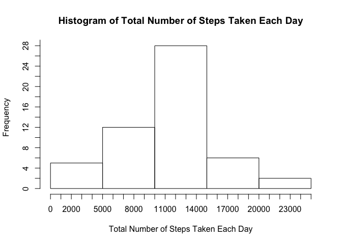
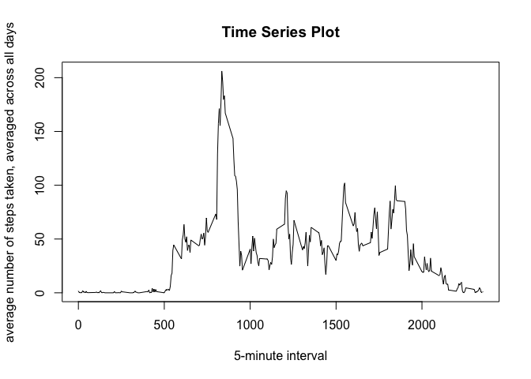
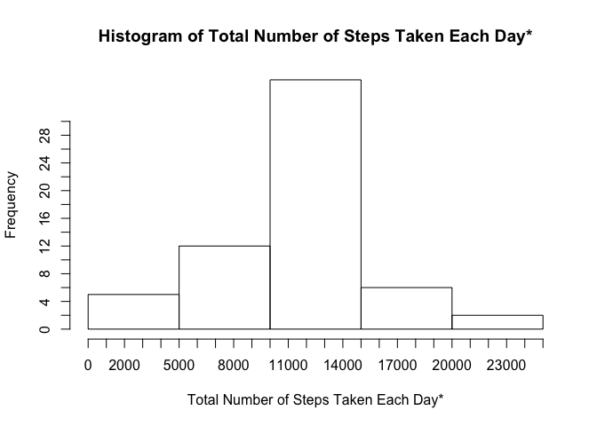
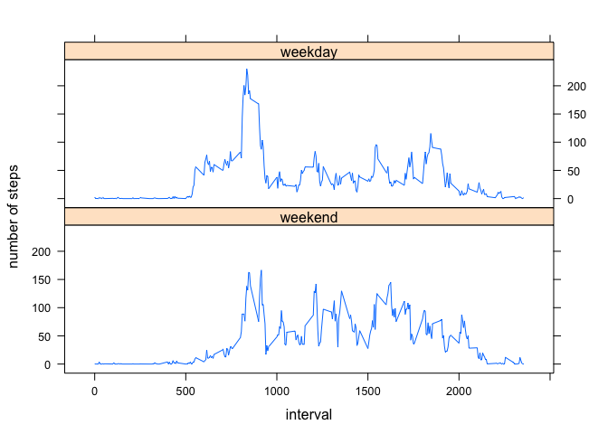

# Reproducible Research: Peer Assessment 1


##1. Loading and preprocessing the data

###1.1 Load the data (i.e. read.csv())


```r
        unzip("activity.zip")
        ActData<-read.csv("activity.csv",header=TRUE,colClasses = c('numeric','character','numeric'))
```
###1.2. Process/transform the data (if necessary) into a format suitable for your analysis

```r
        ##convert date column to date format
        ActData$date<-as.Date(ActData$date)
        ##check dimension and preview data
        dim(ActData) 
```

```
## [1] 17568     3
```

```r
        head(ActData,2)
```

```
##   steps       date interval
## 1    NA 2012-10-01        0
## 2    NA 2012-10-01        5
```
##2. What is mean total number of steps taken per day?
###2.1. Make a histogram of the total number of steps taken each day

```r
        ##remove NAs
        ActData1<-ActData[!is.na(ActData$steps),]
        ##Compute for the total number of steps taken per day
        StepsPerDay<-aggregate(ActData1$steps,list(Date=ActData1$date),sum)
        ##create histogram
        hist(StepsPerDay$x,main="Histogram of Total Number of Steps Taken Each Day",xlab="Total Number of Steps Taken Each Day",freq=TRUE,axes=F)
        xinterval<-c(0:25)*1000
        yinterval<-c(0:15)*2
        axis(2,at=yinterval,labels=yinterval)
        axis(1,at=xinterval,labels=xinterval)
```

 

###2.2. Calculate and report the mean and median total number of steps taken per day

####2.2.1 The mean total number of steps taken per day is: 

```r
        meanStepsPerDay<-mean(StepsPerDay$x)
        meanStepsPerDay 
```

```
## [1] 10766.19
```
  
####2.2.2 The median total number of steps taken per day is:

```r
        medianStepsPerDay<-median(StepsPerDay$x)
        medianStepsPerDay
```

```
## [1] 10765
```

##3.  What is the average daily activity pattern?

###3.1. Make a time series plot (i.e. type = "l") of the 5-minute interval (x-axis) and the average number of steps taken, averaged across all days (y-axis)

```r
        AverageSteps<-aggregate(ActData1$steps,list(Interval=ActData1$interval),mean)
        ##preview data
        head(AverageSteps,2)
```

```
##   Interval         x
## 1        0 1.7169811
## 2        5 0.3396226
```

```r
        ##create time series plot
        plot(AverageSteps$Interval,AverageSteps$x,type="l",xlab = "5-minute interval",ylab = "average number of steps taken, averaged across all days",main="Time Series Plot")
```

 


###3.2. Which 5-minute interval, on average across all the days in the dataset, contains the maximum number of steps?

```r
        ##On the average, the maximum number of steps was observed for 5-minute interval entry:
        ## where column "Interval" refers to the 5-minute interval with maximum number of steps 
        ##(under column "x") 
        IntervalMaxNumSteps<-subset(AverageSteps,x==max(AverageSteps$x))
        IntervalMaxNumSteps
```

```
##     Interval        x
## 104      835 206.1698
```


##4. Imputing missing values
###Note that there are a number of days/intervals where there are missing values (coded as NA). The presence of missing days may introduce bias into some calculations or summaries of the data.

###4.1. Calculate and report the total number of missing values in the dataset (i.e. the total number of rows with NAs)

```r
        ##Subject dataset to logical test is.na and store the result to ActDataNA object
        ActDataNA<-is.na(ActData$steps)
        ##NA data has logical value of 1 or TRUE ; to get number of rows with NAs,
        ##apply sum function
        TotalNAs<-sum(ActDataNA)
        TotalNAs
```

```
## [1] 2304
```

```r
        ##number of rows with NAs is 2304
```
  

###4.2. Devise a strategy for filling in all of the missing values in the dataset. The strategy does not need to be sophisticated. For example, you could use the mean/median for that day, or the mean for that 5-minute interval, etc.
####Strategy for filling in all missing values in the dataset:
####  4.2.1.  Split dataset into subset of rows with NAs(MyNAs) and without NAs(MyNonNAs)
####  4.2.2.  Get the average number of steps taken per interval period (across all days) and store in object AverageSteps
####  4.2.3.  Replace NAs with average data by merging MyNAs object with AverageSteps object
####  4.2.4.  Append results of step C to MyNonNAs object
 

###4.3. Create a new dataset that is equal to the original dataset but with the missing data filled in.
#### Following strategy outlined in 4.2...
#### 4.3.1.  Split dataset into subset of rows with NAs(MyNAs) and without NAs(MyNonNAs)

```r
        MyNAs<-ActData[is.na(ActData$steps),]
        MyNonNAs<-ActData[!is.na(ActData$steps),]
```

#### 4.3.2.  Get the average number of steps taken per interval period (across all days) and store in object AverageSteps


```r
        AverageSteps<-aggregate(MyNonNAs$steps,list(interval=MyNonNAs$interval),mean)
```

#### 4.3.3.  Replace NAs with average data by merging MyNAs object with AverageSteps object

```r
        MyNAsReplaced<-merge(MyNAs,AverageSteps,by=c("interval"))
        ##rearrange columns to match original column order, rename columns to original
        MyNAsReplaced1<-MyNAsReplaced[,c(4,3,1)]
        names(MyNAsReplaced1)<-names(MyNonNAs)
```
#### 4.3.4.  Append results of step C to MyNonNAs object

```r
        ProcessedData<-rbind(MyNonNAs,MyNAsReplaced1)
        ##preview processed data and check number of rows equal to original
        head(ProcessedData,3)
```

```
##     steps       date interval
## 289     0 2012-10-02        0
## 290     0 2012-10-02        5
## 291     0 2012-10-02       10
```

```r
        dim(ProcessedData)
```

```
## [1] 17568     3
```

###4.4. Make a histogram of the total number of steps taken each day and Calculate and report the mean and median total number of steps taken per day. Do these values differ from the estimates from the first part of the assignment? What is the impact of imputing missing data on the estimates of the total daily number of steps?
####ANS.  The distribution pattern of unprocessed and processed data is almost the same; the median and mean values are almost the same as well.  Impact of imputing missing value is on computed maximum total number of steps per day and increase in Frequency data (as NAs are filled in and included in dataset considered for plotting)


```r
        ##Compute for the total number of steps taken per day based on Processed Data (NAs filled in)
        StepsPerDay1<-aggregate(ProcessedData$steps,list(Date=ProcessedData$date),sum)
        ## create histogram of Processed Data
        hist(StepsPerDay1$x,main="Histogram of Total Number of Steps Taken Each Day*",xlab="Total Number of Steps Taken Each Day*",freq=TRUE,axes=F)
        xinterval<-c(0:25)*1000
        yinterval<-c(0:15)*2
        axis(2,at=yinterval,labels=yinterval)
        axis(1,at=xinterval,labels=xinterval)
```

 

####  The mean total number of steps taken per day based on Processed Data (NAs filled in) : 

```r
        meanStepsPerDay1<-mean(StepsPerDay1$x)
        meanStepsPerDay1 
```

```
## [1] 10766.19
```
  
####  The median total number of steps taken per day based on Processed Data (NAs filled in):

```r
        medianStepsPerDay1<-median(StepsPerDay1$x)
        medianStepsPerDay1
```

```
## [1] 10766.19
```

##5. Are there differences in activity patterns between weekdays and weekends?

###ANS.  Based on below data, there are differences in activity patterns between weekdays and weekends.  There is a sharp peak within the 500-1000 interval point range during weekdays. In contrast, peaks are comparatively distributed across 500-2000 interval point range during weekends.


###For this part the weekdays() function may be of some help here. Use the dataset with the filled-in missing values for this part.

###5.1. Create a new factor variable in the dataset with two levels -- "weekday" and "weekend" indicating whether a given date is a weekday or weekend day.


```r
        ##load dplyr library
        library(dplyr)
```

```
## 
## Attaching package: 'dplyr'
## 
## The following object is masked from 'package:stats':
## 
##     filter
## 
## The following objects are masked from 'package:base':
## 
##     intersect, setdiff, setequal, union
```

```r
        ##create vector of weekends
        wkends<-c('Saturday','Sunday')
        ##create new factor variable "wkfactor" using filled in Data
        ProcessedDataFactor<-mutate(ProcessedData,
                               wkfactor=factor((weekdays(ProcessedData$date)%in% wkends),
                                                levels=c(TRUE,FALSE),
                                                labels=c('weekend','weekday')))
        ##checking output
        head(ProcessedDataFactor,6)
```

```
##   steps       date interval wkfactor
## 1     0 2012-10-02        0  weekday
## 2     0 2012-10-02        5  weekday
## 3     0 2012-10-02       10  weekday
## 4     0 2012-10-02       15  weekday
## 5     0 2012-10-02       20  weekday
## 6     0 2012-10-02       25  weekday
```

```r
        dim(ProcessedDataFactor)
```

```
## [1] 17568     4
```

```r
        table(ProcessedDataFactor$wkfactor)
```

```
## 
## weekend weekday 
##    4608   12960
```


###5.2. Make a panel plot containing a time series plot (i.e. type = "l") of the 5-minute interval (x-axis) and the average number of steps taken, averaged across all weekday days or weekend days (y-axis). The plot should look something like the following, which was created using simulated data:


```r
        ##Subset processed data to weekdays and weekends
        ProcessedDataWkDay<-subset(ProcessedDataFactor,wkfactor=='weekday')
        ProcessedDataWkEnd<-subset(ProcessedDataFactor,wkfactor=='weekend')
        ##calculate average steps per interval accross weekdays and weekends
        AverageStepsWkDay<-aggregate(ProcessedDataWkDay$steps,list(Interval=ProcessedDataWkDay$interval,wkfactor=ProcessedDataWkDay$wkfactor),mean)
        AverageStepsWkEnd<-aggregate(ProcessedDataWkEnd$steps,list(Interval=ProcessedDataWkEnd$interval,wkfactor=ProcessedDataWkEnd$wkfactor),mean)
        ##consolidate tables containing average steps per interval on weekends and weekdays
        AverageStepsCombined<-rbind(AverageStepsWkEnd,AverageStepsWkDay)
        ##preview data
        head(AverageStepsCombined,2)
```

```
##   Interval wkfactor          x
## 1        0  weekend 0.21462264
## 2        5  weekend 0.04245283
```

```r
        tail(AverageStepsCombined,2)
```

```
##     Interval wkfactor         x
## 575     2350  weekday 0.2968553
## 576     2355  weekday 1.4100629
```

```r
        ##create time series plot
        ##load lattice package
        library(lattice)
        ##call xyplot function
        xyplot(x~Interval|as.factor(wkfactor),AverageStepsCombined,layout=c(1,2),type='l',xlab="interval",ylab="number of steps")
```

 
